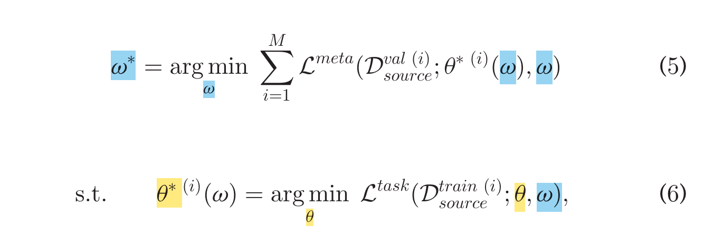
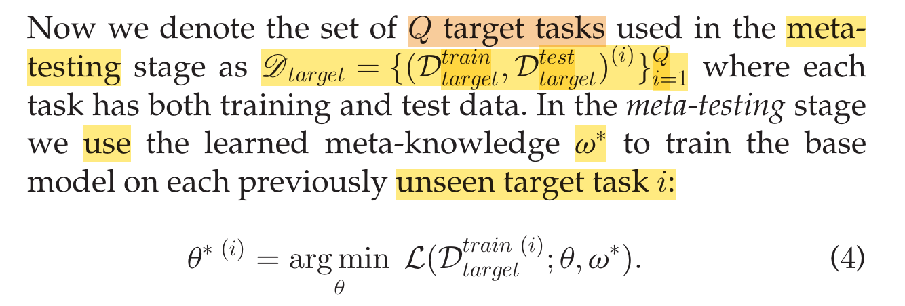

## Concepts

### Meta-training

* Imagine there is a function of which w is the parameter.

$$a+b$$

```
f(.; w)
```

* Consider each source set (corresponding to a task) as an example, including its input and labels.

```
d_source = {d_source_input, d_source_label}
```

* We can use the f(d_source; w) to get a value.

```
d_source_label_pred = f(d_source_input; w)
```

* However, f(d_source; w) includes a hidden parameter, denoted `a`, which is the model parameter learned to solve this task (d_source). So,

```
d_source_label_pred = f(d_source_input; a, w)
```

* Before we can perform the above prediction, we need first learn `a`. To this end, we separate d_source into d_source_train and d_source_val. Consequently, the prediction becomes

```
d_source_label_pred = f(d_source_val_input; a(d_source_train, w), w)
d_source_train = d_source_train_input + d_source_train_label
```

* This is not just a function of w because it includes an optimization problem per se. It needs to get `a(d_source_train, w)` through that optimization.
* Once `a(d_source_train, w)` is obtained, a loss function can be used to evaluate the quality of the prediction for meta-training as follows

```
L(d_source_val_label, d_source_val_label_pred), i.e.
L(d_source_val_label, f(d_source_val_input; a(d_source_train, w), w))
```

* While L(., .) can be the generalization accuracy, we can simply use `g(.)`, a function characterizing the runtime performance.

```
g(d_source_val; a(d_source_train, w), w)
```

* We can perform the above training and validation for many source datasets (tasks) and get the average loss, which is used as the objective for minimization in order to get `w`. 
  - A gradient-based method would need the explicit form of `f(d_source_val_input; a(d_source_train, w), w)`
  - Maybe heuristic search like `PSO` can be applied 

In summary,
  * A source dataset, or a source task, is one example, drawn from a distribution of tasks
  * It can also be performed using a single source dataset
  * Meta-training consists of a two-level optimization, where the `w` is fixed when learning `a(d_source_train, w)` and `a` is fixed when learning `w`.
  * A complex part is that when `w` changes, the function `f(d_source_val_input; a(d_source_train, w), w)` changes not only due to the change of `w` but also that of `a`.



### Meta-testing

